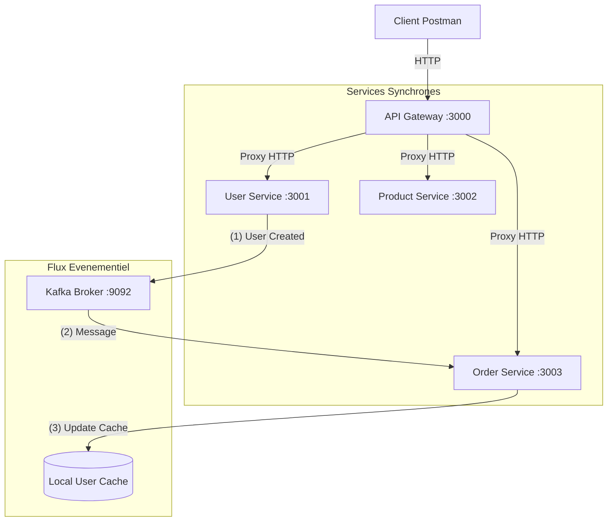

# 🚀 Microservices Demo – Node.js + Express + Kafka

Projet pédagogique démontrant une architecture microservices hybride (Synchrone HTTP + Asynchrone Kafka).

---

## 📁 Structure du projet

```
Microservices/
├── api-gateway/       ← Port 3000 (Point d'entrée / Proxy)
├── user-service/      ← Port 3001 (Gestion Users + Kafka Producer)
├── product-service/   ← Port 3002 (Gestion Produits)
└── order-service/     ← Port 3003 (Gestion Commandes + Kafka Consumer)
```

---

## ⚙️ Installation & Prérequis

### 1. Kafka (Obligatoire pour la synchronisation)
Le projet utilise **Kafka** pour synchroniser les utilisateurs entre les services.
```bash
# Lancer Kafka via Docker
docker run -p 9092:9092 apache/kafka
```

### 2. Dépendances Node.js
Dans chaque dossier, installez les modules :
```bash
npm install
```

---

## ▶️ Lancement

Ouvrez **4 terminaux** et démarrez chaque service :

```bash
# Terminal 1, 2, 3, 4
cd user-service    && node index.js
cd product-service && node index.js
cd order-service   && node index.js
cd api-gateway     && node index.js
```

---

## 🏗️ Architecture du Système

Le système combine deux modes de communication :
- **Synchrone (HTTP)** : Pour les requêtes instantanées (Gateway vers Services).
- **Asynchrone (Kafka)** : Pour garder les services synchronisés sans dépendance directe.



---

## 🧪 Guide de Test (Postman / cURL)

Utilisez toujours le port **3000** (Gateway).

### 👤 1. Créer un Utilisateur (Async Flow)
Lors de la création, `user-service` informe Kafka, qui notifie `order-service`.
```bash
POST http://localhost:3000/api/users
Content-Type: application/json
{ "name": "Alice", "email": "alice@mail.com" }
```

### 🛒 2. Voir une Commande (Preuve de Sync)
`order-service` affiche les infos utilisateur depuis son **cache local**.
```bash
GET http://localhost:3000/api/v1/orders/101
```

### 📊 3. Dashboard (Sync Flow)
Appelle `user-service` et `product-service` en **parallèle** via `Promise.all`.
```bash
GET http://localhost:3000/api/v1/dashboard
```

---

## 🧰 Stack Technique
- **Backend** : Node.js, Express.js
- **Messagerie** : KafkaJS (Kafka)
- **Client HTTP** : Axios (Gateway)
- **Stockage** : En mémoire (In-Memory)
