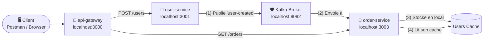

# 🚀 Microservices Demo – Node.js + Express.js

Architecture microservices pédagogique avec **4 services indépendants** qui communiquent via une API Gateway.

---

## 📁 Structure du projet

```
Microservices/
├── api-gateway/           ← Port 3000 – point d'entrée unique
│   ├── index.js
│   └── package.json
├── user-service/          ← Port 3001 – gestion des utilisateurs
│   ├── index.js
│   └── package.json
├── product-service/       ← Port 3002 – gestion des produits
│   ├── index.js
│   └── package.json
├── order-service/         ← Port 3003 – commandes (appelle user-service)
│   ├── index.js
│   └── package.json
├── .gitignore
└── README.md
```

---

## ⚙️ Installation

Dans chaque dossier de service, exécuter :

```bash
npm install
```

Ou étape par étape :

```bash
cd user-service    && npm install
cd ../product-service && npm install
cd ../order-service   && npm install
cd ../api-gateway     && npm install
```

---

## ▶️ Lancement

> ⚠️ Ouvrir **4 terminaux séparés** et lancer chaque service.

**Terminal 1 – user-service**
```bash
cd user-service
node index.js
# ✅ user-service démarré sur http://localhost:3001
```

**Terminal 2 – product-service**
```bash
cd product-service
node index.js
# ✅ product-service démarré sur http://localhost:3002
```

**Terminal 3 – order-service**
```bash
cd order-service
node index.js
# ✅ order-service démarré sur http://localhost:3003
```

**Terminal 4 – api-gateway**
```bash
cd api-gateway
node index.js
# ✅ api-gateway démarré sur http://localhost:3000
```

---

## 🧪 Tester avec Postman

> Utiliser toujours le port **3000** (api-gateway).  
> Dans Postman : `Body` → `raw` → `JSON` pour les requêtes POST.

### 👤 Utilisateurs

#### GET – Lister les utilisateurs
```
GET http://localhost:3000/api/users
```
**Réponse :**
```json
{
  "success": true,
  "count": 2,
  "data": [
    { "id": 1, "name": "Alice Dupont", "email": "alice@mail.com" },
    { "id": 2, "name": "Bob Martin",   "email": "bob@mail.com"   }
  ]
}
```

#### POST – Ajouter un utilisateur
```
POST http://localhost:3000/api/users
Content-Type: application/json
```
**Body :**
```json
{
  "name": "Charlie Durand",
  "email": "charlie@mail.com"
}
```

---

### 📦 Produits

#### GET – Lister les produits
```
GET http://localhost:3000/api/products
```
**Réponse :**
```json
{
  "success": true,
  "count": 3,
  "data": [
    { "id": 1, "name": "Laptop Pro",       "price": 1200 },
    { "id": 2, "name": "Souris sans fil",  "price": 35   },
    { "id": 3, "name": "Clavier mécanique","price": 89   }
  ]
}
```

#### POST – Ajouter un produit
```
POST http://localhost:3000/api/products
Content-Type: application/json
```
**Body :**
```json
{
  "name": "Écran 4K",
  "price": 450
}
```

---

### 🛒 Commandes — Communication inter-services (order-service → user-service)

> `order-service` appelle **directement** `user-service` pour enrichir la réponse avec les infos de l'utilisateur.

| Méthode | Endpoint | Description |
|:-------:|----------|-------------|
| `GET` | `/api/v1/orders` | Liste toutes les commandes |
| `GET` | `/api/v1/orders/:id` | Commande enrichie avec les infos utilisateur |
| `POST` | `/api/v1/orders` | Crée une nouvelle commande |

**GET** `/api/v1/orders/101` — Réponse (order-service appelle user-service en interne) :
```json
{
  "success": true,
  "data": {
    "orderId": 101,
    "product": "Laptop",
    "quantity": 1,
    "price": 1200,
    "user": {
      "id": 1,
      "name": "Alice Dupont",
      "email": "alice@mail.com"
    }
  }
}
```

**POST** `/api/v1/orders`
```bash
curl -X POST http://localhost:3000/api/v1/orders \
  -H "Content-Type: application/json" \
  -d '{"userId": 1, "product": "Écran 4K", "quantity": 1, "price": 450}'
```

---

### 📊 Dashboard — Communication inter-services

> Cet endpoint est l'exemple clé du projet : il appelle **les deux services simultanément** via `Promise.all` et retourne les données fusionnées en une seule réponse.

| Méthode | Endpoint | Description |
|:-------:|----------|-------------|
| `GET` | `/api/v1/dashboard` | Agrège users + products en parallèle |

**GET** `/api/v1/dashboard`
```bash
curl http://localhost:3000/api/v1/dashboard
```

**Réponse :**
```json
{
  "success": true,
  "dashboard": {
    "users": {
      "count": 2,
      "data": [
        { "id": 1, "name": "Alice Dupont", "email": "alice@mail.com" },
        { "id": 2, "name": "Bob Martin",   "email": "bob@mail.com"  }
      ]
    },
    "products": {
      "count": 3,
      "data": [
        { "id": 1, "name": "Laptop Pro",        "price": 1200 },
        { "id": 2, "name": "Souris sans fil",   "price": 35   },
        { "id": 3, "name": "Clavier mécanique", "price": 89   }
      ]
    }
  }
}
```

**Comment ça marche (extrait de `api-gateway/index.js`) :**
```js
const [usersResponse, productsResponse] = await Promise.all([
  axios.get('http://localhost:3001/users'),    // → user-service
  axios.get('http://localhost:3002/products'), // → product-service
]);
```
> `Promise.all` lance les deux requêtes **en parallèle** — plus rapide qu'en séquence.

---

## 🔍 Tests directs (sans gateway)

Les services peuvent aussi être testés directement :

| URL directe | Équivalent gateway |
|---|---|
| `http://localhost:3001/users` | `http://localhost:3000/api/users` |
| `http://localhost:3002/products` | `http://localhost:3000/api/products` |

---

## 🏗️ Architecture Événementielle (Event-Driven)



---

## 🚀 Prérequis : Kafka

Pour faire tourner le projet, vous devez avoir un broker Kafka actif sur le port **9092**.

**Lancer Kafka avec Docker (recommandé) :**
```bash
docker run -p 9092:9092 apache/kafka
```

---

## 🧰 Stack technique

| Technologie | Rôle |
|-------------|------|
| **Node.js** | Runtime JavaScript |
| **Express.js** | Framework HTTP |
| **KafkaJS** | Client Kafka pour synchronisation asynchrone |
| **Axios** | Communication HTTP (Gateway vers services) |

---

## 📝 Notes sur le flux Kafka

1.  **user-service** (Producer) : Publie un événement `user-created` lors de chaque création.
2.  **order-service** (Consumer) : Écoute les événements et maintient son **cache local**.
3.  **Découplage** : Les services sont totalement indépendants grâce à Kafka.

> Aucune base de données requise.  
> Les données sont stockées **en mémoire** et synchronisées via **Kafka**.
